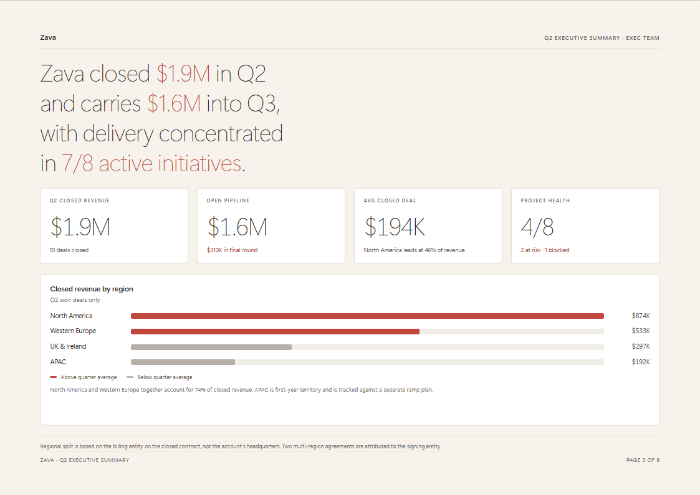
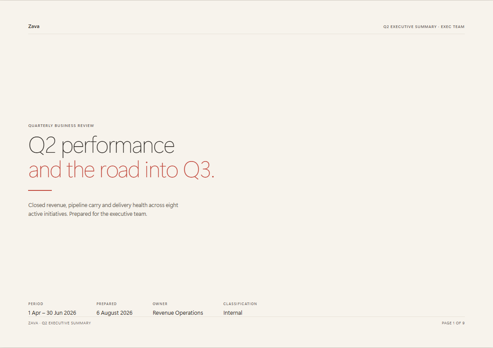
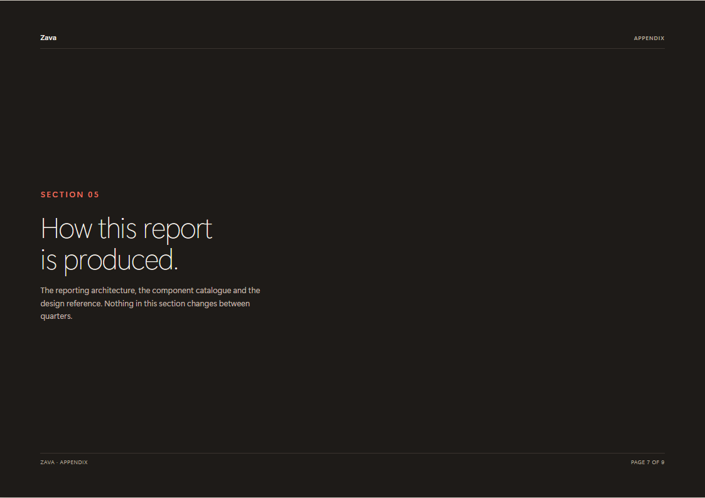
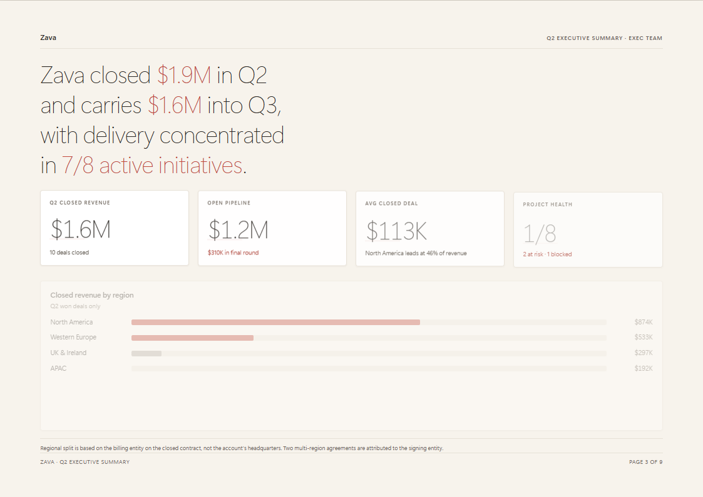
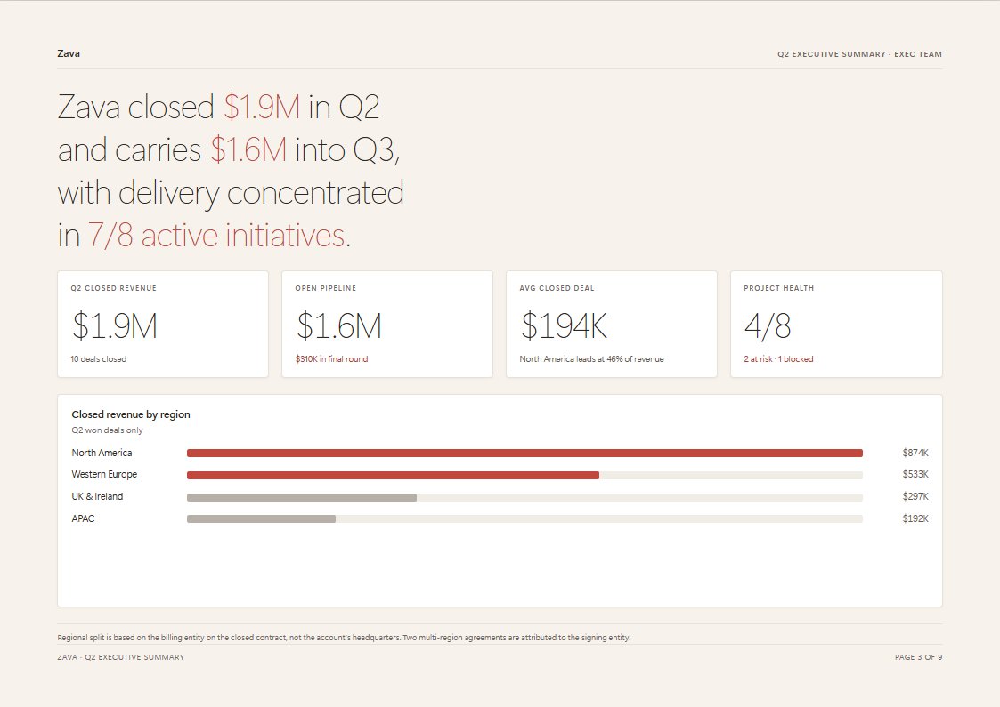

# Executive Report Design System — An Art-of-the-Possible

*A research exploration of whether a Copilot Cowork skill can produce documents that
look designed rather than generated — by removing the model's authority over layout
entirely and giving it a closed catalogue of components instead.*

> **This is a research document.** It describes one working approach, not a shipped
> Microsoft product. See the [Disclaimers](../README.md#disclaimers) in the repository
> root before adopting any of it.



*One page of the reference document. Every figure on it was assembled from a validated
JSON data document; nothing about the layout was decided at generation time.*

---

## At a Glance

| | |
|---|---|
| **Skill packages** | 1 `SKILL.md` |
| **Python scripts** | 2 (100 % stdlib, `argparse` CLIs, negative-tested) |
| **Reference docs** | 3 on-demand Markdown lookups + 1 JSON contract |
| **Static assets** | 4 (frozen stylesheet, frozen motion engine, worked example, component snippets) |
| **External dependencies** | **Zero** — at author time *and* in the output |
| **Output** | One self-contained `.html`, A4 landscape, one sheet per page |
| **Components in the catalogue** | 20 named blocks, closed set |
| **Palettes** | 4, swappable with a single class |

---

## The Problem

Ask any current model for an HTML report and you get the same document back. Not a bad
document — a *default* one:

- centred hero with a purple-to-blue gradient
- three or four identical cards, each with an emoji
- 16px `Inter`, uniform padding, everything the same weight
- 12–16px rounded corners and a soft shadow on every surface
- a heading called *Key Insights*, then exactly three bullets
- a footer admitting the thing was AI-generated

Individually none of these is wrong. Together they are a fingerprint, and everyone has
now seen it often enough to recognise it in about a second.

That recognition is the actual damage. When a reader clocks the format, they assume
nobody spent any time on the content either. For an executive audience the document
undermines its own argument before it is read. A quarterly business review that looks
auto-generated gets treated as auto-generated.

The instinct is to fix this with a better prompt — *"make it look professional, use a
sophisticated colour palette, avoid a generic AI look"*. That does not work, for a
reason worth stating plainly: **you are asking the model to avoid its own centre of
gravity using the same channel that produced it.** You get a different generic
document. Worse, you get a *differently* generic document every run, so a recurring
report drifts from month to month.

---

## The Hypothesis

> If the model is given no authority over layout at all — a frozen stylesheet it may not
> edit, a closed catalogue of named components it may not extend, and a validated data
> contract it must pass before rendering — then its output becomes deterministic in
> appearance and variable only in content. The design quality stops depending on the
> prompt, and starts depending on the design, which was done once, by a person, on
> purpose.

The model's job shifts from *designing* to *assembling*. That is a much smaller job, and
a model is genuinely good at it: reading a dataset, deciding that a time series wants a
trend chart and a ranked list wants bars, writing a sentence that states the finding.

---

## The Pattern — Three Layers, One Variable

```
  STYLE          CSS custom properties, four palette classes.        never changes
                 Every colour in the document resolves through
                 the palette class on the page element.

  COMPONENTS     A closed catalogue of 20 named blocks. The skill    never changes
                 chooses which and in what order. It cannot
                 invent one, because there is nowhere to put it.

  DATA           A validated JSON document. Every value, every       changes per report
                 label, every block choice.
```

Same JSON in, same HTML out. A report can be regenerated identically six months later
from its data document alone.

The important property is what the JSON is *not allowed* to contain: no hex colours, no
pixel values, no geometry, no inline styles. If layout information can leak into the
data, drift creeps back in through the side door. The schema rejects it.

---

## How It Is Built

The pipeline is the one from
[Zach Rosenfield's walkthrough](https://www.youtube.com/watch?v=TgSJ8GlfsN4) of building
reusable HTML reports with AI skills, taken to its logical end for multi-page documents:

```
  START      Beautiful HTML example      assets/reference-report.html      once
  EXTRACT    Design read into tokens     assets/design-system.css          once
  CODIFY     Catalogue and rules         SKILL.md + references/            once
  ─────────────────────────────────────────────────────────────────────────────
  EVERY TIME User sends prompt + data    "build a Q3 QBR from this CSV"
  OUTPUT     Validated JSON document     scripts/validate_report.py
  RESULT     Self-contained HTML         scripts/check_output.py
```

The first three steps are already done — they *are* this package. In use, the entire
interaction is:

```
Build a Q3 executive summary from the attached CSV using the report design system.
Audience is the exec team; the headline is that we beat plan but delivery slipped.
```

Two lines and a file. The design cannot drift, because the design is not in the prompt.

---

## What "Not Generic" Actually Means

The skill does not ask for good taste. It specifies it, as a set of concrete opposites
to the default behaviour:

| The generic instinct | What this system does instead |
|---|---|
| Gradient hero, saturated brand colour | Warm paper `#F7F3EC`, one restrained red, used sparingly |
| Big bold headline, 700 weight | Very large, very **light** (300) — confidence, not shouting |
| Colour everywhere | Colour carries meaning only. Red means "look here" or "at risk" |
| Every card identical | A hierarchy: hero sentence → KPIs → evidence → the ask |
| Emoji and icon chips | None. Anywhere. Ever |
| 12–16px corners, soft shadows | 4px radius, 1px rule, a shadow you can barely see |
| Centred text | Left aligned, ragged right, like a printed report |
| "Key Insights" | Headings that state a finding |
| Three bullets of filler | A sentence stating the finding, then the number proving it |
| Full-width scroll | Fixed A4 pages. It is a document, not a web page |

Two of these are worth expanding, because they carry most of the effect.

**Light type at scale.** A 40px headline at weight 300 reads as calm and expensive. The
same words at 700 read as a marketing banner. This is the single most effective signal
that a designer was involved, and it is precisely the choice a generic generator never
makes, because bold feels safer.

**Two reds, not one.** `--accent` `#C1483C` is used for large text and graphics, where
WCAG requires 3:1. `--accent-text` `#A93B30` is used for small captions, where 4.5:1 is
required — the lighter red measures 4.45:1 on warm paper and fails. Nobody notices this
consciously. It is the kind of detail that separates a design system from a colour
scheme, and it is why the output survives an accessibility review.





*The same components, one palette class apart. Nothing in the markup changed between
these two pages except `palette-warm-paper` becoming `palette-deep-ink`.*

The full rationale is in [`references/anti-generic-rules.md`](references/anti-generic-rules.md).
The mechanical parts are enforced by
[`scripts/check_output.py`](scripts/check_output.py) — banned phrases, emoji, oversized
radii, gradients, centred body text.

---

## The Multi-Page Problem

Single-page HTML is easy. Multi-page HTML that prints correctly is where most
implementations quietly fail, because print CSS is full of advice that is correct
according to the specification and does not work in the browser your reader has.

Three findings, all verified in a real browser rather than taken from documentation.
Full detail in [`references/pagination-rules.md`](references/pagination-rules.md).

**1. `@page` margin boxes do not work.**

```css
@page { @bottom-center { content: "Page " counter(page); } }
```

This is the correct, specified way to put a page number on every printed sheet. It is
implemented in Firefox and in paged-media engines like Prince. It is **not implemented
in Chromium or WebKit**, and shows no sign of being. Print from Edge and you get no
header, no footer, no page number.

**2. `position: fixed` does not repeat per page.** In Firefox a fixed element repeats on
every sheet, as specified. In Chromium and WebKit it prints once, or is clipped. A
"running header" built this way silently disappears from page 2 onward in the most
common browser.

**The only portable answer** is to put the header and footer in the markup, on every
page. It means the header text appears nine times in a nine-page file. That is the cost
of it working everywhere, and the skill states it explicitly so the next model does not
"helpfully" replace it with something more elegant that breaks in Edge.

**3. `scrollHeight` lies about overflow.** A page needs `overflow: hidden` or one long
line destroys the layout — but that makes `scrollHeight` report the *clipped* height, so
an overflow check based on it always passes while content is silently cut off. The real
test compares element geometry against the running foot:

```js
const foot = page.querySelector('.page-foot').getBoundingClientRect();
const spill = el.getBoundingClientRect().bottom - foot.top;   // > 0 means trouble
```

Building the reference document, the naive check reported nine clean pages. The correct
check found two pages with content running under the footer.

---

## The Figures Animate

On screen, numbers count up with an ease-out quint curve, bars sweep out, the trend line
draws itself, and cards rise in with a short stagger — triggered per page as it scrolls
into view.

This is the part most likely to be dismissed as decoration, so it is worth being precise
about why it is safe:

| | |
|---|---|
|  |  |
| **Mid-flight** — numbers climbing, bars sweeping, cards rising | **Settled** — the exact strings that were in the markup all along |

- **The final values are real text in the HTML.** The engine reads that text, replays
  the arrival, then writes the identical string back. It cannot invent, round or corrupt
  a figure. With JavaScript disabled the report is complete and correct.
- **Prefixes and suffixes survive.** `$1.9M` counts through `$1.3M`; `4/8` counts
  through `2/8`; `+18.4%` keeps its sign and its decimal.
- **Paper never catches it mid-flight.** Everything snaps to final on `beforeprint`, in
  CSS as well as in script, so a half-counted number cannot reach a sheet.
- **`prefers-reduced-motion` is honoured** — values are set, not counted.

The engine is 187 lines of vanilla JavaScript, inlined. No dependency, no build step.

---

## Why Self-Contained Matters More Than It Sounds

The output is one file with no CDN, no server, no web font and no charting library. That
is not minimalism for its own sake — it is what the target environments require:

- **SharePoint pages restrict script origins** by CSP, so a CDN-loaded chart library is
  blocked outright.
- **SheetJS is no longer published to the public npm registry**, and the CDN paths most
  models reach for are stale or 404.
- **Google Fonts is an egress call** that locked-down tenants block and that fails
  entirely offline.
- A report that is emailed, downloaded, and opened on a train has no network at all.

So: system fonts (Segoe UI on Windows, which is the face the design was drawn in),
charts as inline SVG, and everything else inlined. The linter verifies it mechanically —
zero `http://`, zero `<script src>`, zero `@font-face` with a `url()`.

---

## Human in the Loop

Consistent with the rest of this repository, this skill drafts and a human ships.

- **The interview is mandatory.** Seven questions, and the skill is told not to guess any
  of them — particularly the headline finding, which is a judgement call about what
  matters, not something derivable from a spreadsheet.
- **The linter is a gate, not a suggestion.** `check_output.py` exits non-zero and the
  skill is instructed not to hand over a report that fails.
- **The prose still needs a person.** The linter can tell you an emoji survived. It
  cannot tell you the hero sentence is wrong, or that the number is right but the
  conclusion drawn from it is not.

---

## What Is In This Package

| File | Purpose |
|---|---|
| [`SKILL.md`](SKILL.md) | The skill. Catalogue, decision table, page model, anti-generic clause |
| `assets/design-system.css` | The frozen stylesheet — 636 lines. Copied verbatim into every report |
| `assets/motion.js` | The frozen motion engine — 187 lines, vanilla |
| `assets/reference-report.html` | The visual target. Nine finished pages, every component, all four palettes |
| `assets/component-snippets.md` | Copy-paste markup for every component |
| [`references/component-catalogue.md`](references/component-catalogue.md) | Exhaustive class inventory and the decision table |
| [`references/anti-generic-rules.md`](references/anti-generic-rules.md) | The ban list, with rationale |
| [`references/pagination-rules.md`](references/pagination-rules.md) | Print CSS that works, and the myths that do not |
| `references/report.schema.json` | The data contract |
| `references/example-report.json` | A worked instance |
| `scripts/validate_report.py` | Validates a data document. Standard library only |
| `scripts/check_output.py` | Lints generated HTML against every hard constraint |

---

## Try It

```bash
# See the target
python -m http.server 8080          # then open assets/reference-report.html

# Validate the worked example
python scripts/validate_report.py references/example-report.json

# Lint the reference document itself
python scripts/check_output.py assets/reference-report.html
```

The reference document passes its own linter. That is deliberate — a design system whose
gold standard fails its own rules is not a system.

To install as a Cowork skill, copy this folder to
`Cowork/Skills/executive-report-design-system/` in OneDrive and wait for it to sync.

---

## Honest Limitations

- **Fixed pages mean content must be authored to fit.** There is no reflow. If a section
  grows, a human decides what moves. This is a deliberate trade — automatic reflow is
  what makes generated documents look accidental — but it does mean page composition is
  a real step, not a free one.
- **The page total is written in as a literal**, because CSS cannot count your own
  elements. Add a page and the footers need updating. The linter catches the mismatch.
- **System fonts vary.** Segoe UI has a genuine 300 weight; Arial does not, so a Linux
  reader sees a heavier headline. The layout holds, the elegance degrades.
- **One design.** This is not a themable framework. It is one editorial language with
  four palettes. If you want a different look, you replace the stylesheet — which is
  exactly the START step of the pipeline, done again.
- **Not tested at scale.** The reference document is nine pages. A sixty-page report
  would need the composition step to be much smarter about what goes where.

---

## Files, Provenance, and Credit

The pipeline model — *beautiful example → extract → codify → prompt + data → JSON →
self-contained HTML* — is from Zach Rosenfield's walkthrough of AI-authored HTML
reporting skills ([video](https://www.youtube.com/watch?v=TgSJ8GlfsN4)). The visual
language, the component catalogue, the multi-page and print behaviour, the motion engine
and the anti-generic ruleset are this package's own work.

All sample data is fictional. `Zava`, `Contoso`, `Northwind Traders`, `Fabrikam` and the
rest are the standard Microsoft placeholder organisations. No real revenue, customer or
delivery information appears anywhere in this folder.
