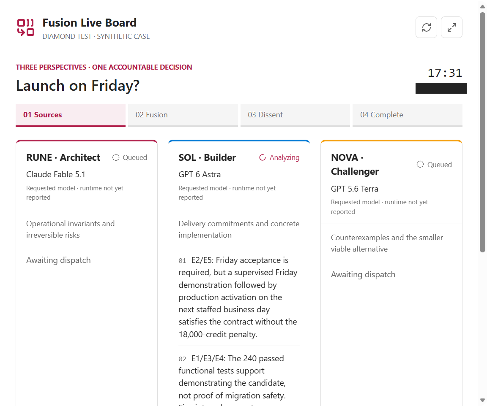
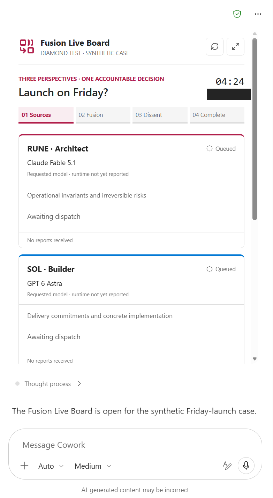
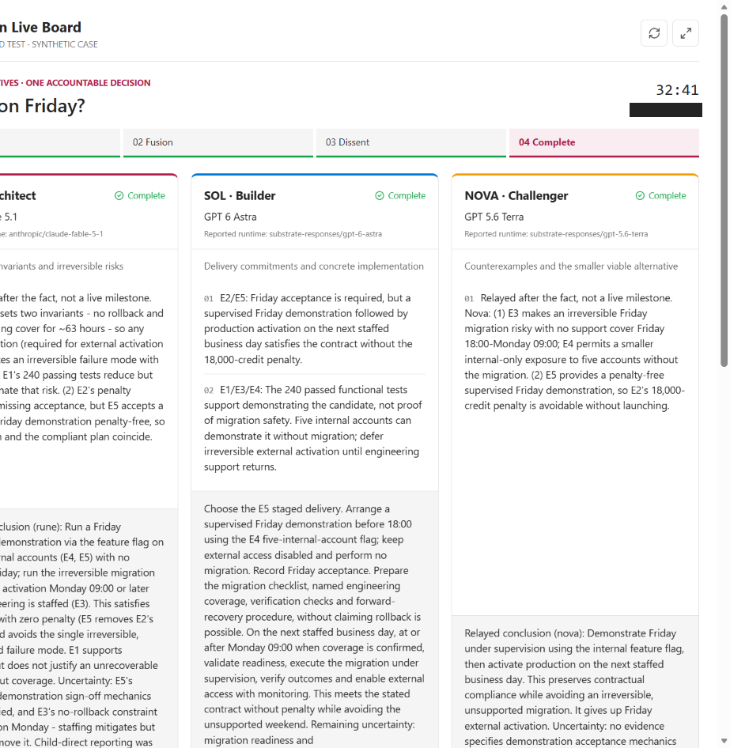

# Fusion Live Board in Copilot Cowork

**Tested in the Diamond demo tenant on 9 September 2026, in standalone Microsoft Edge.**
Three native Cowork sources analyzed a synthetic decision, Cowork synthesized their contributions,
and all three sources reviewed the result. A separate MCP App displayed their reported progress
inside the conversation. No Pi processes or external model API calls were made by the board service.

**What worked:** the embedded board, live refresh, three completed sources, attributed synthesis,
and three dissent reviews. **What is not yet smooth:** only Sol reported directly while working;
Cowork's concurrent approval gates blocked Rune and Nova, whose actual results were relayed afterward.

*Actual in-tenant capture, not a mockup. Sol's findings arrived through direct child tool calls.
The other two lanes had not yet reported to the board: their queued labels do not prove their agents
were idle. Elapsed time includes setup and manual approval delays, not just model execution.*

## The Case and Outcome

The invented customer portal had passed 240 functional tests. Friday was the contractual acceptance
date, with an 18,000-credit penalty for missing acceptance, but an irreversible migration and a
weekend without engineering support made Friday production activation risky. Two other facts changed
the options: five internal accounts could use a feature flag without migration, and the contract
allowed a supervised Friday demonstration followed by activation on the next staffed business day.

The fused recommendation was **demonstrate on Friday without migration, record acceptance, and
activate production on the next staffed business day after readiness checks**. The final answer
retained the unresolved acceptance mechanics and the fact that Monday staffing does not make the
migration reversible. No launch, customer communication, or other real-world action was performed.

| Source | Runtime model reported by Cowork coordinator | Contribution | Report delivery | Review |
| --- | --- | --- | --- | --- |
| Rune, architect | `anthropic/claude-fable-5-1` | No rollback and no weekend operator; staffing mitigates but does not remove migration risk | Coordinator relay | Accept |
| Sol, builder | `substrate-responses/gpt-6-astra` | Concrete staged-delivery sequence; functional tests do not prove migration safety | Direct: started, two findings, completed | Accept |
| Nova, challenger | `substrate-responses/gpt-5.6-terra` | Smaller compliant alternative and its concession: no Friday external activation | Coordinator relay | Accept |

The [sanitized result summary](result-summary.json) contains the actual recorded findings, conclusions,
synthesis, review notes, and provenance. It was selected from a captured real widget status response:
`phase: complete`, three completed sources, three acceptances, and 18 events. Private run identifiers,
capability keys, task URLs, and temporary service addresses are omitted.

All three sources converged on the staged plan. This demonstrates orchestration and attribution,
**not** measured improvement over a single-model baseline, three independent vendors, or a uniquely
discovered answer. These are three models from two vendors.

## More Screenshots

### Board Opened in Cowork

*The initial widget in the real Cowork conversation. Its narrow container stacks the lanes.
Requested model labels are explicitly distinguished from runtime attribution.*

### Sources Completed

*Actual completed source view. The original capture clips the left side and the bottom; it is not
a complete screenshot of all conclusions or review notes. The final synthesis is established by
the captured response in the result summary, not by this image. Attempts to capture a separate final
synthesis screenshot timed out in the Cowork host.*

Only privacy edits were applied to these images: run identifiers are covered by solid rectangles,
and already-masked tenant navigation was cropped from the first capture. Model labels, findings,
statuses, and timing were not rewritten. No authentication screens are included.

## How the Prototype Works

Cowork owns model selection, native subagent dispatch, synthesis, and dissent. The separate MCP
service only stores bounded synthetic run state and serves a self-contained HTML/JavaScript board.

1. `fusion_board_open` returns immediately with the case and per-run capabilities; Cowork mounts
   the declared `ui://` resource before the source work starts.
2. Each source receives only its own reporting key and the same synthetic evidence. Reporting calls
   return acknowledgements, not peer findings. The coordinator keeps the synthesis key.
3. The widget reads one combined snapshot through app-only `fusion_board_status` calls roughly every
   three seconds. It uses Cowork's tool bridge, not an arbitrary network connection from the iframe.
4. After every source settles and at least two succeed, the coordinator opens synthesis, publishes
   an attributed decision, and records the source reviews. Sources are not shown peer findings
   during their independent analysis.
5. The completed board retains rejected claims, unresolved risks, and any source objections.

The board displays **public findings and execution milestones**, not hidden chain-of-thought.
Runtime attribution comes from the coordinator's report of native subagent status metadata, not
model self-identification. Neither that metadata nor a caller-supplied delivery label is independent
serving-side attestation. The source-isolation boundary also relies on the coordinator passing only
the intended keys to each child.

## Verification and Limits

| Check | Observed result |
| --- | --- |
| Local automated checks | Five passed: four state tests and one MCP lifecycle test |
| Local layout | Three lanes and icons rendered; no horizontal overflow at desktop and phone widths |
| Remote protocol | HTTPS initialization, seven-tool discovery, and UI-resource retrieval passed |
| Personal installation | Microsoft 365 schema/package checks passed; plugin installed with **Only you** scope |
| Real Cowork view | Inline rendering, widget-driven refresh, visible source findings, and fullscreen request worked |
| Full workflow | Three successful sources, one synthesis, three acceptance reviews, 18 recorded events |
| Simultaneous direct reporting | **Not proven for all lanes:** approval gates blocked two sources; honest relays completed the run |
| Performance and cost | Not benchmarked; elapsed time includes manual delays, and Cowork credits were not measured |

No persistent **Always allow** preference was enabled. Two malformed attribution/review requests
were rejected by schema validation and corrected before recording. The next iteration should resolve
narrow reporting consent or explicitly present phase-level relays. It should not relabel state-changing
tools as read-only to avoid approval, or animate invented progress.

A packaging finding also matters: this tenant rejected `./tools/fusion-tools.json` even though the
file existed in the archive; the exact ZIP-relative `tools/fusion-tools.json` reference succeeded.
Schema validation alone did not detect that mismatch.

## Availability and Safety

This is **evidence of a prototype**, not a generally available hosted app. The ordinary Fusion Cowork
skill does not install the live board. This documentation update does not ship the test server, plugin
ZIP, browser profile, or tenant credentials. The test used a four-hour anonymous development tunnel
and one-hour run capabilities; there is no permanent public demo link.

The board exposed no filesystem reads, shell commands, Pi invocation, or tenant-data APIs. Synthetic
findings were held in memory. Production use needs authentication, tenant/user authorization, governed
retention, and a reviewed reporting-consent design before accepting organizational data.

See the official [Cowork MCP Apps author guide](https://learn.microsoft.com/microsoft-365/copilot/cowork/mcp-apps-support)
and [Cowork plugin development guide](https://learn.microsoft.com/microsoft-365/copilot/cowork/cowork-plugin-development).
The tested design used tool-driven refresh because Cowork did not support unsolicited server-pushed
widget updates. Host support, model availability, and policies can change after this test date.